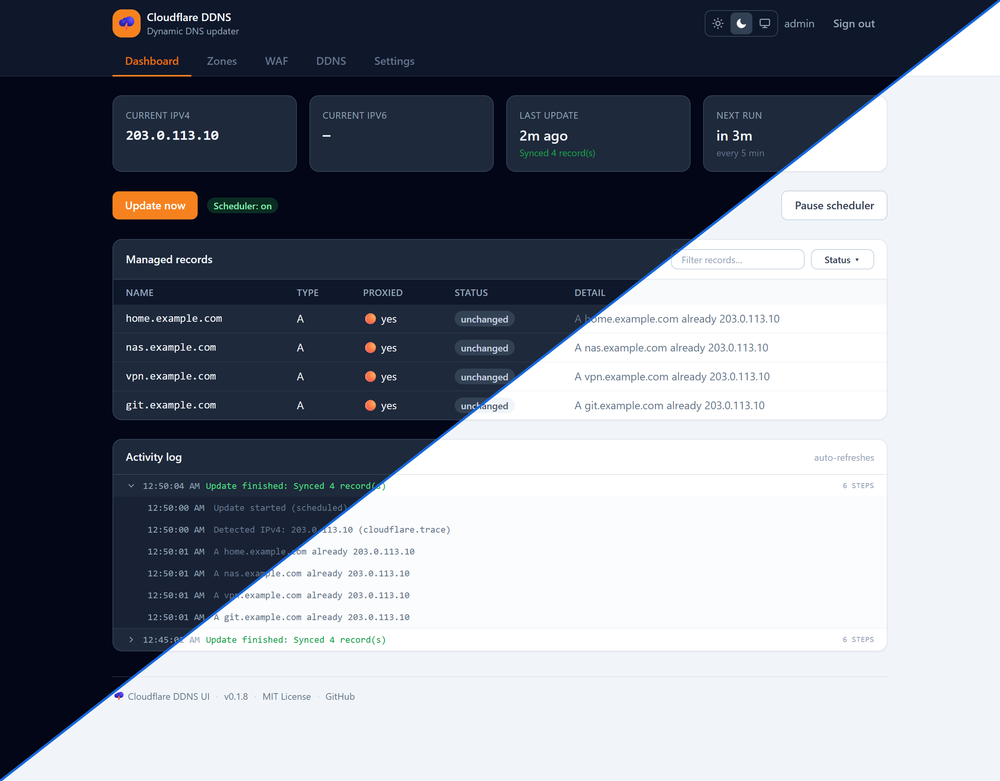

# Cloudflare DDNS UI

[](https://github.com/mansoor/cloudflare-ddns-ui/releases)
[](https://github.com/mansoor/cloudflare-ddns-ui/pkgs/container/cloudflare-ddns-ui)
[](LICENSE)

A small self-hosted **dynamic DNS updater for Cloudflare** with a clean web UI — inspired by
[timothymiller/cloudflare-ddns](https://github.com/timothymiller/cloudflare-ddns), but you configure
everything (API token, zones, subdomains, A/AAAA records, proxying, TTL, IP providers, schedule)
through a **Tailwind** web form instead of editing `config.json` by hand.

It detects your public IPv4/IPv6 on a schedule and creates or updates the matching Cloudflare
`A` / `AAAA` records — so a home server on a dynamic IP stays reachable via your domain.



## Features

- 🖥️ **Web UI** — no JSON editing; add zones and subdomains through forms
- 🔐 **Login-protected** — single admin account (session cookie + bcrypt)
- 🌐 **IPv4 + IPv6** — independent providers (`cloudflare.trace`, `ipify`, custom URL, or off)
- ⏱️ **Scheduler** — configurable interval, runs on startup, "Update now" button, and a **Pause/Resume** toggle (the paused state persists across restarts)
- 🎯 **Per-zone update & enable/disable** — an "Update" badge syncs just one zone on demand; toggle a zone off to park it without deleting
- 🛡️ **WAF / IP Lists** — keep a Cloudflare account-level IP List updated with your current IP, to reference in firewall rules
- 🦆 **Other DDNS providers** *(opt-in)* — DuckDNS, FreeDNS, & generic DynDNS2 (No-IP, Dynu, Namecheap, deSEC, …) behind a flag
- 🔔 **Notifications** — Discord, Slack, or a generic webhook/ntfy, on update failures, IP changes, and/or successful record changes (each toggleable)
- 🎨 **Light / Dark / System** theme
- ✅ **Idempotent** — only touches records that actually changed
- 🔎 **Live dashboard** — current IPs, per-record status, activity log
- 🐳 **Docker-ready** — published image, config persisted to a volume

## Quick start

The image is published to GitHub Container Registry — you don't need the source, just Docker.

### Option A — `docker run`

```bash
docker run -d \
  --name cloudflare-ddns-ui \
  -p 8080:8080 \
  -e ADMIN_USERNAME=admin \
  -e ADMIN_PASSWORD=change-me \
  -e ENABLE_NON_CLOUDFLARE_DDNS=false \
  -v "$PWD/data:/data" \
  --restart unless-stopped \
  ghcr.io/mansoor/cloudflare-ddns-ui:latest
```

### Option B — Docker Compose (recommended)

Save this as `docker-compose.yml`, then run `docker compose up -d`:

```yaml
services:
  cloudflare-ddns-ui:
    image: ghcr.io/mansoor/cloudflare-ddns-ui:latest
    container_name: cloudflare-ddns-ui
    restart: unless-stopped
    ports:
      - "8080:8080"
    environment:
      ADMIN_USERNAME: admin
      ADMIN_PASSWORD: change-me                # leave blank to get a random one in the logs
      SESSION_SECRET: ""                       # leave blank to auto-generate (persisted in ./data)
      ENABLE_NON_CLOUDFLARE_DDNS: "false"      # set "true" for the DuckDNS / DynDNS2 tab
    volumes:
      - ./data:/data
```

```bash
docker compose up -d
```

Then open <http://localhost:8080>. If you left `ADMIN_PASSWORD` blank, grab the generated one:

```bash
docker compose logs | grep -A2 "Generated a temporary password"
```

Config and secrets persist in `./data`. Pin a version with `:v0.1.0` instead of `:latest`. Hit a
problem? See [Troubleshooting](#troubleshooting).

## Configuration (environment)

| Variable         | Default   | Description |
|------------------|-----------|-------------|
| `PORT`           | `8080`    | HTTP port for the UI |
| `ADMIN_USERNAME` | `admin`   | Admin login name |
| `ADMIN_PASSWORD` | *(random)*| Admin password. If unset, a random one is generated and logged once on boot |
| `SESSION_SECRET` | *(random)*| Cookie-signing secret. If unset, one is generated and saved to `data/.session-secret` |
| `DATA_DIR`       | `/data`   | Where `config.json` and secrets are stored (container default `/data`) |
| `ENABLE_NON_CLOUDFLARE_DDNS` | *(off)* | Set truthy to enable the optional **Other DDNS** tab (DuckDNS / DynDNS2) |

All DNS configuration lives in the UI (persisted to `data/config.json`).

## Getting a Cloudflare API token

1. Cloudflare dashboard → **My Profile → API Tokens → Create Token**.
2. Use the **Edit zone DNS** template (or a custom token with `Zone → DNS → Edit`).
3. Scope it to the zone(s) you want to manage.
4. In the UI: **Zones → Add zone**, paste the token, click **Verify & load zones**, pick the zone,
   add subdomains, and **Save**.

The token is stored server-side in `data/config.json` and is never sent back to the browser — the
UI only shows the last 4 characters.

## WAF / Cloudflare IP Lists

The **WAF** tab keeps an account-level Cloudflare **IP List** updated with your current public IP,
so you can reference that list in a WAF/firewall rule to allow access from your dynamic IP.

1. Create an IP List in the Cloudflare dashboard (Account Home → Manage Account → Configurations → Lists).
2. Create a token with **Account → Account Filter Lists → Edit**.
3. In the UI: **WAF → Add list**, paste the Account ID + token, **Verify & load lists**, pick the list, Save.

Only list items tagged with the list's **managed comment** (default `cf-ddns-ui`) are touched — any
entries you added manually are left alone.

## Notifications

Add channels under **Settings → Notifications** and choose which events fire (each is toggleable):
**update failures**, **IP address change**, **successful record changes**.

| Channel | What you provide |
|---|---|
| **Discord** | Incoming **webhook URL** (Server Settings → Integrations → Webhooks) |
| **Slack** | Incoming **webhook URL** |
| **Generic webhook / ntfy** | A **URL** + payload format: `JSON` (Gotify, Home Assistant, custom) or `Plain text` (ntfy topic). Optional `auth_header` like `Authorization: Bearer …` |

Use **Send test** on a saved channel to confirm it works. IP-change alerts fire once per change
(the last IP is persisted to `data/runtime.json`) and never on first-ever detection.

## Other DDNS providers (optional)

This is a Cloudflare-first tool, but if you also have a one-off dynamic host on **DuckDNS**, **FreeDNS**
(afraid.org), or a **DynDNS2**-compatible provider (No-IP, Dynu, Namecheap, deSEC, many routers), you can
keep it updated here too — no need for a second tool. It rides on the same schedule, IP detection,
activity log, and notifications.

Enable it by setting `ENABLE_NON_CLOUDFLARE_DDNS=true`; a **DDNS** tab appears. Then **Add provider**:

| Provider | What you provide |
|---|---|
| **DuckDNS** | Domain(s) (without `.duckdns.org`) + your **token** |
| **FreeDNS** (afraid.org) | Pick a **method**: *Update token/URL* — one or more per-host update tokens/URLs (add as many as you like); or *Username & password* — hostname + credentials (DynDNS2-style) |
| **DynDNS2** | **Server host** (e.g. `dynupdate.no-ip.com`), **hostname**, **username**, **password**, HTTPS on/off |

**Test** does a live update and shows the provider's response. When off, the tab is hidden and these
providers are never contacted — your Cloudflare setup is completely unaffected either way.

## Notes & limitations

- **Pre-1.0 (0.x):** still stabilizing — expect occasional changes until `v1.0.0`.
- Manages **A / AAAA** records and account **IP Lists**. Load balancers are still out of scope.
- Non-Cloudflare DDNS (**DuckDNS / DynDNS2**) is **opt-in** via `ENABLE_NON_CLOUDFLARE_DDNS`, and stays
  hidden/inactive when off — the Cloudflare path is unaffected either way.
- Notifications cover Discord, Slack, and generic webhook/ntfy (the webhook channel also covers
  Gotify / Home Assistant / custom endpoints). Telegram/Pushover aren't built in.
- WAF list-item changes use Cloudflare's async bulk API — the UI reports "submitted".
- Single admin login (no multi-user / RBAC).
- Tokens, passwords, and webhook URLs are stored in plaintext in `data/config.json` (same trust model
  as the reference app's config file) and redacted over the API. Keep the `data` directory and login private.

## How it works

```
IP provider (trace/ipify/custom) ──▶ current public IP
                                         │
config.json (zones + subdomains) ──▶ updater ──▶ Cloudflare API (A/AAAA upsert)
                                         │
                                    scheduler (cron)  ◀── "Update now"
```

- `src/ip.js` — public IP detection
- `src/cloudflare.js` — Cloudflare API v4 client (DNS records + account IP lists)
- `src/updater.js` — the sync engine (create / update / unchanged / optional purge / WAF / DDNS / notifications)
- `src/scheduler.js` — cron loop, reschedules when you save settings
- `src/notify.js` — Discord / Slack / webhook senders · `src/runtime.js` — last-IP persistence
- `src/ddns.js` — DuckDNS / FreeDNS / DynDNS2 providers · `src/features.js` — opt-in feature flags
- `src/routes/api.js` — REST API behind session auth
- `web/` — Tailwind UI (login + dashboard / zones / waf / ddns / settings)

## Build from source

Clone the repo, then either build the image locally with the bundled compose file (it builds from
the `Dockerfile` instead of pulling from GHCR):

```bash
docker compose up --build -d
```

…or run it directly with **Node.js 20+**:

```bash
npm install
npm run build:css      # compile Tailwind -> public/app.css
npm start              # or: npm run dev  (auto-reload + pretty logs)
```

During UI work, watch the CSS in a second terminal: `npm run watch:css`.

Releases are cut by pushing a `v*` tag — the [`docker-release`](.github/workflows/docker-release.yml)
workflow builds and publishes `ghcr.io/mansoor/cloudflare-ddns-ui` with `:vX.Y.Z` and `:latest` tags.

## Troubleshooting

**`EACCES: permission denied` on `/data`.** The container fixes the data directory's ownership on
startup, so make sure you're on the latest image (`docker compose pull && docker compose up -d`). As a
fallback you can run `sudo chown -R 1000:1000 ./data` once.

**Forgot the admin password / can't sign in.** If `ADMIN_PASSWORD` is unset, a random one is printed
once on first boot — grab it with `docker compose logs | grep -A2 "Generated a temporary password"`.
Set `ADMIN_PASSWORD` in your env/compose to make it permanent (a change needs a restart).

**Sessions drop on every restart.** Set a fixed `SESSION_SECRET`. If it's blank, one is generated and
saved to `data/.session-secret`, so this only bites when the `./data` volume isn't persistent.

**"Verify & load zones" (or WAF) fails.** Check the token scope — **Zone → DNS → Edit** for zones,
**Account → Account Filter Lists → Edit** for WAF lists — and that it covers the right zone/account.
The exact Cloudflare error appears in the dashboard's activity log.

**Records aren't updating.** Confirm the scheduler isn't paused (dashboard badge), the zone is saved,
the A/AAAA toggles and IP provider are set, then hit **Update now** and read the activity log. Note the
detected IP is your *public* IP as seen by the provider — behind CGNAT, DDNS can't make you reachable.

**Notifications not arriving.** Use **Send test** on the channel, verify the webhook URL, and make sure
the relevant event toggle is on. Send failures are logged in the activity log.

**`docker pull` says `unauthorized`/`denied`.** The official image is public, so this shouldn't happen.
If you *forked* and published your own package, it may be private — make it public (repo → **Packages**
→ **Package settings** → change visibility) or `docker login ghcr.io` first.

## License

MIT — see [LICENSE](LICENSE).
